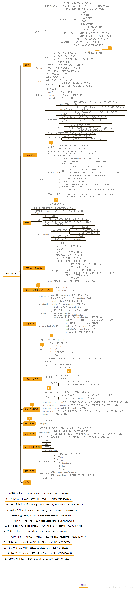

# 编程语言C++
## 知识图谱

## 内容

内容：
结合 C++ 的知识图谱，对 C++ 语言的学习，建议顺序是这样的：

    基础语言
    类与面向对象
    输入输出
    字符串处理（类库和正则表达式）
    容器类库
    泛型算法
    多线程
    原子操作

大概过一下知识点，具体可以参考知识图谱。孟岩有一篇名为“快速掌握一个语言最常用的50%”的文章，有很强的参考意义，值得一读。对于 C++ 语言来讲，快速熟悉1、2、3、4、5这几部分，就可以动手做一些好玩的小程序了。

大家在学习编程的时候会遇到非常多的问题没人帮你解决，迷茫是正常的，不怕学不会就怕不想学，大家可以加我的二千人群 487790381，每天直播课分享，实战项目教学，学习规范的代码风格，里面有很多大神比较热情的，我也会分享大家一些学习资料和学习视频

    基础语言

这部分要了解 C++ 语言的基本数据类型、比如 int 、 char 、 bool 、 unsigned int 、 long 、 float 、 double 、 、 long long 、 enum 、 union 等等。能理解指针、引用等概念。

掌握基本的编程语法，比如表达式、运算符、函数等。关于函数，多说两句，C++ 里有函数对象，在标准库里广泛应用，需要了解；另外 C++11 支持 lambda 表达式（匿名函数），威力强大，建议学习。不过这两点可以稍往后放放。

主要的语言结构，比如 if-else 、 for 、 switch-case 、 while 、 do-while等。

    类与面向对象

了解 class 的概念，了解继承、虚函数、重载、重写、多态、纯虚函数、多重继承等概念，它们是面向对象编程在语言层面的基础。

面向对象更重要的是思想，很多 C 系程序员一直都在用类来写过程式程序。

    输入输出

要做编程练习，了解基本的输入输出操作是必须的。

C++ 里输入输出分 C 和 C++ 两部分。C 风格的 printf 系列函数、 FILE 、 fopen 、 fread 、 fwrite 等等或 C++ 风格的 istream 、 ostream 、 iostream 、 ifstream 、 ofstream 、 fstream等都可以完成输入输出操作 。

    字符串处理

字符串处理是我们编程时使用频率最高的，C++ 里有 C 风格的字符串库，比如 strcmp 、 strcpy 、 strstr 、 strchr 等函数，也有更为方便和智能的字符串类，如 string 、 wstring 等，看看 API ，练习一下就可以掌握。

C++11 为了更方便字符串处理，提供了正则表达式类库，比如 regex 类，regex_match、regex_search、regex_replace等方法，以及 regex_iterator 这个迭代器类。用起来非常方便，功能也很强大。

    容器类库

常见的容器，如 vector 、 list 、 map 、 set 、queue 、 stack 、 deque 、 multimap 、 multiset 等，基本可以满足日常的开发需要。C++11 引入了定长数组 array ，具有 C 风格数据的特性，更有 C++ 的便利操作；还有 unordered_set 、 unordered_map 等新的非排序容器，可以适应不需要排序的场景。

    泛型编程

C++ 里的泛型算法库，用起来非常方便，比如 find 、 find_if 、 count 、 count_if 、search 、search_n 、 copy 、 copy_n 、 copy_if 、 sort 、 partial_sort 、 binary_search 、 stable_sort 等等，功能非常强大。这些算法多数基于容器和迭代器，忽略具体数据类型，使用起来稍稍有些难度，不过掌握了容器、模板、迭代器等内容后，就可以很快应用起来。

    多线程和原子操作

这些都是 C++11 引入的类库，从此以后，C++语言本身有了并发编程的能力，非常酷。一个 thread 类，三五行代码，就可以启动一个线程，简单的使用 mutex 和 lock_guard ，就可以完成线程间的资源同步与保护，棒极了。

## 书籍推荐:  
- C++ Primer  
- Effective C++ 
- More Effective C++ 
- STL 源码剖析
- 深度探索C++对象模型
- C++ Concurrency In Action 
